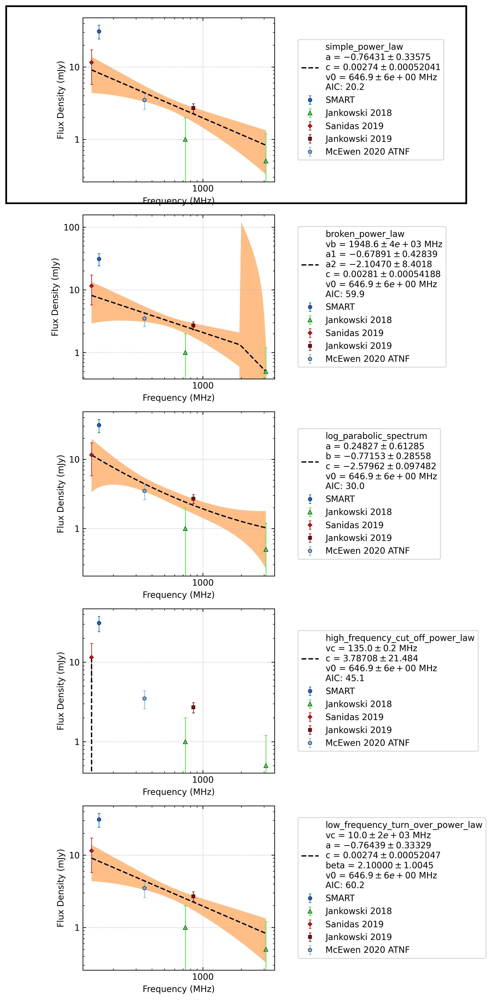
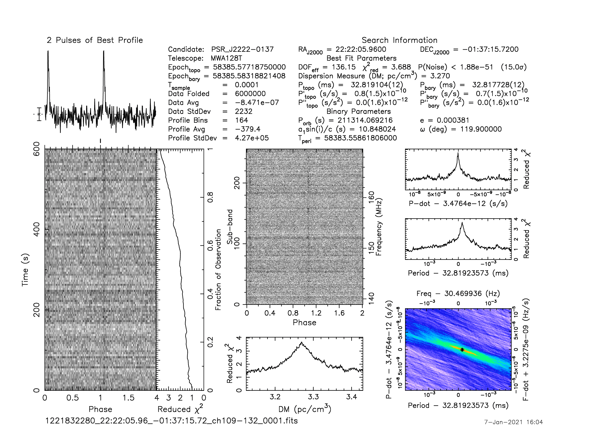
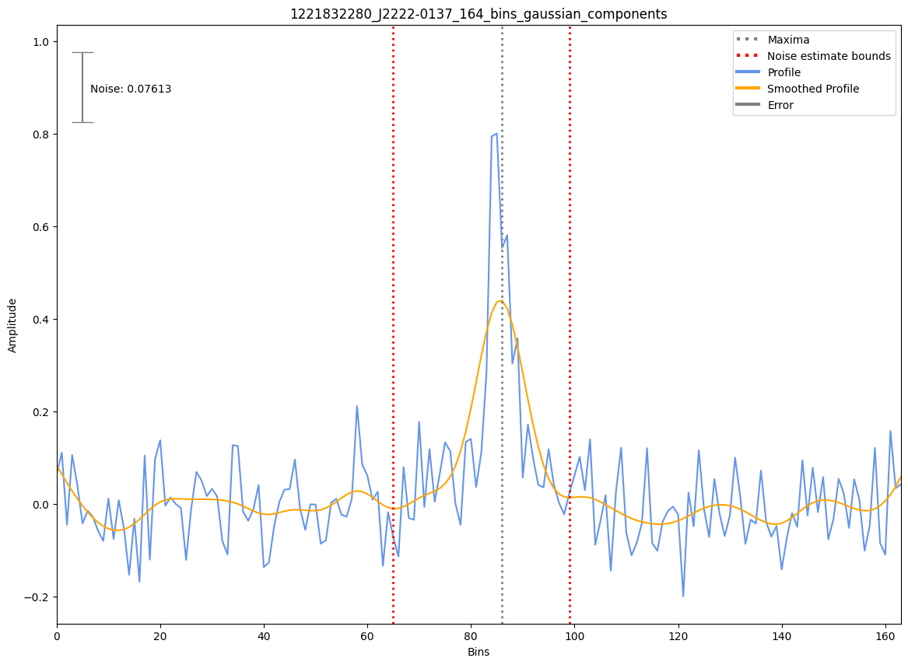

.. _J2222-0137:
J2222-0137
==========

Best Fit
--------
.. image:: best_fits/J2222-0137_fit.png
  :width: 800

.. csv-table:: J2222-0137 fit results
   :header: "model","a","c","v0 (MHz)"

   "simple_power_law","-0.76±0.34","0.00±0.00","646±6"

Fit Before MWA
--------------

.. csv-table:: J2222-0137 before fit results
   :header: "model","a","c","v0 (MHz)"

   "simple_power_law","-0.65±0.32","0.00±0.00","646±6"

Flux Density Results
--------------------
.. csv-table:: J2222-0137 flux density total results
   :header: "N obs", "Flux Density (mJy)", "u_S_mean", "u_scint", "m_r_v"

   "1",  "31.0±45.4", "6.7", "44.9", "1.449"

.. csv-table:: J2222-0137 flux density individual results
   :header: "ObsID", "Flux Density (mJy)"

    "1221832280", "31.0±6.7"

Comparison Fit
--------------

Detection Plots
---------------

