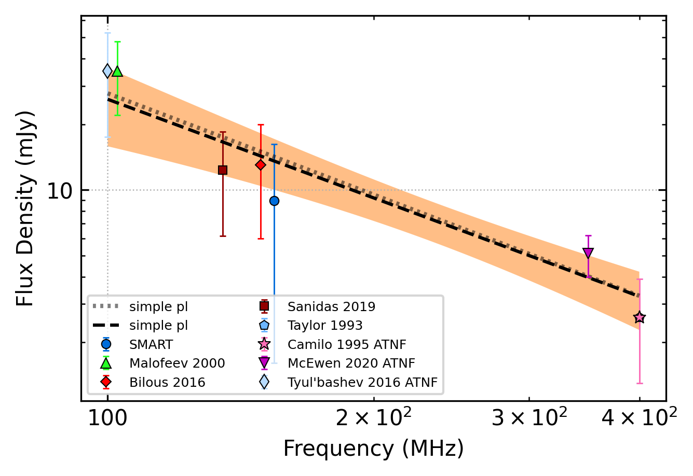
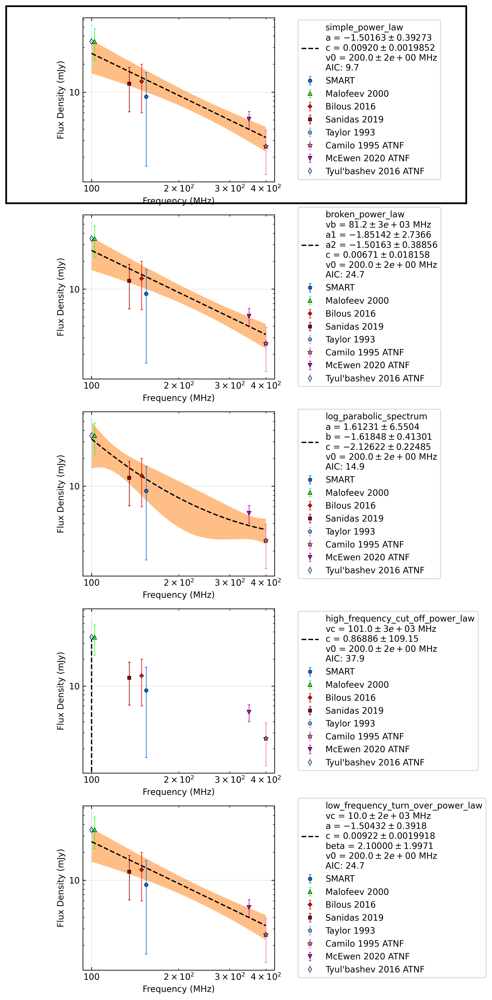

.. _J2234+2114:
J2234+2114
==========

Best Fit
--------

.. csv-table:: J2234+2114 fit results
   :header: "model","a","b","v0 (MHz)"

   "simple_power_law","-1.51±0.42","0.01±0.00","200±2"

Fit Before MWA
--------------

.. csv-table:: J2234+2114 before fit results
   :header: "model","a","b","v0 (MHz)"

   "simple_power_law","-1.55±0.41","0.01±0.00","200±2"

Flux Density Results
--------------------
.. csv-table:: J2234+2114 flux density total results
   :header: "N obs", "Flux Density (mJy)", "u_S_mean", "u_scint", "m_r_v"

   "1",  "8.9±8.5", "7.3", "4.2", "0.476"

.. csv-table:: J2234+2114 flux density individual results
   :header: "ObsID", "Flux Density (mJy)"

    "1223042480", "8.9±7.3"

Comparison Fit
--------------

Detection Plots
---------------

