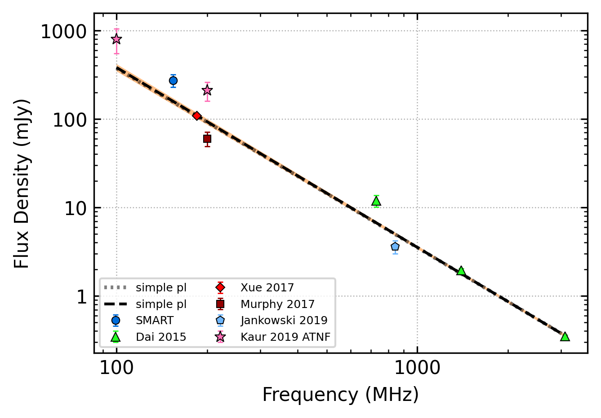

.. _J2241-5236:
J2241-5236
==========

Best Fit
--------

.. csv-table:: J2241-5236 fit results
   :header: "model","vb (MHz)","a1","a2","c","v0 (MHz)"

   "broken_power_law","3517±0","-2.05±0.00","-6.66±0.00","0.01±0.00","501±5"

Fit Before MWA
--------------

.. csv-table:: J2241-5236 before fit results
   :header: "model","a","c","v0 (MHz)"

   "simple_power_law","-2.04±0.03","0.01±0.00","501±5"

Flux Density Results
--------------------
.. csv-table:: J2241-5236 flux density total results
   :header: "N obs", "Flux Density (mJy)", "u_S_mean", "u_scint", "m_r_v"

   "3",  "274.4±204.7", "44.9", "221.4", "0.807"

.. csv-table:: J2241-5236 flux density individual results
   :header: "ObsID", "Flux Density (mJy)"

    "1221399680", "50.1±12.5"
    "1225713560", "68.5±21.4"
    "1224252736", "704.6±37.4"

Comparison Fit
--------------
.. image:: comparison_fits/J2241-5236_comparison_fit.png
  :width: 800

Detection Plots
---------------

.. image:: on_pulse_plots/
  :width: 800

.. image:: on_pulse_plots/
  :width: 800
.. image:: detection_plots/pf_1224252736_J2241-5236_22:41:42.01_-52:36:36.22_b22_PSR_J2241-5236.pfd.png
  :width: 800

.. image:: on_pulse_plots/1224252736_J2241-5236_1024_bins_gaussian_components.png
  :width: 800