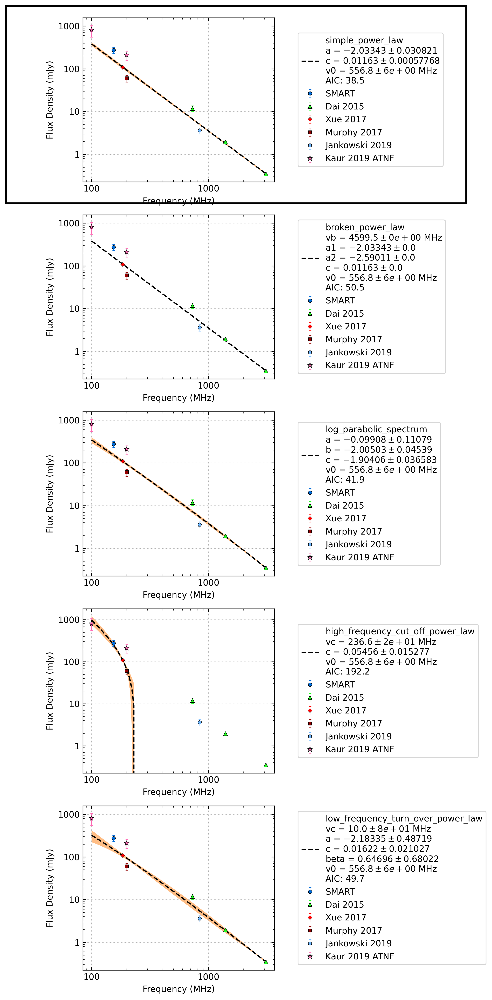

.. _J2241-5236:
J2241-5236
==========

Best Fit
--------
.. image:: best_fits/J2241-5236_simple_power_law_fit.png
  :width: 800

.. csv-table:: J2241-5236 fit results
   :header: "model","a","b"

   "simple_power_law","-1.97±0.11","0.00±0.00"

Fit Before MWA
--------------
.. image:: before_mwa/J2241-5236_simple_power_law_fit.png
  :width: 800

.. csv-table:: J2241-5236 before fit results
   :header: "model","a","b"

   "simple_power_law","-1.96±0.10","0.00±0.00"

Flux Density Results
--------------------
.. csv-table:: J2241-5236 flux density total results
   :header: "N obs", "Flux Density (mJy)", "u_S_mean", "u_scint", "m_r_v"

   "2",  "331.6±254.0", "34.7", "267.5", "0.807"

.. csv-table:: J2241-5236 flux density individual results
   :header: "ObsID", "Flux Density (mJy)"

    "1221399680", "44.9±11.2"
    "1225713560", "nan±nan"
    "1224252736", "618.3±32.9"

Comparison Fit
--------------

Detection Plots
---------------

.. image:: detection_plots/1221399680_J2241-5236_c1221342176_b22.prepfold.png
  :width: 800

.. image:: on_pulse_plots/
  :width: 800
.. image:: detection_plots/pf_1225713560_J2241-5236_22:41:42.01_-52:36:36.22_b22_PSR_J2241-5236.pfd.png
  :width: 800

.. image:: on_pulse_plots/
  :width: 800
.. image:: detection_plots/1224252736_J2241-5236.prepfold.png
  :width: 800

