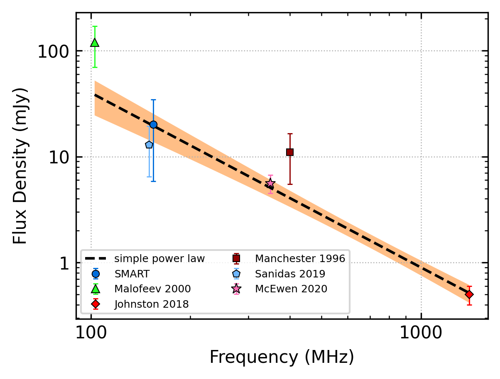
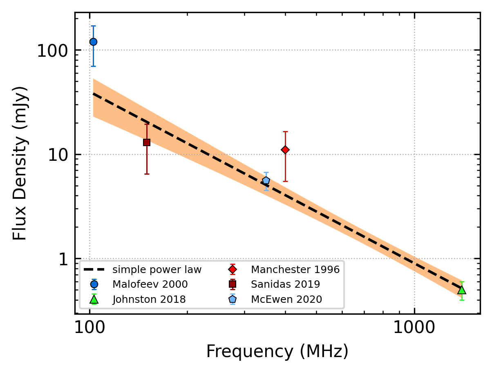
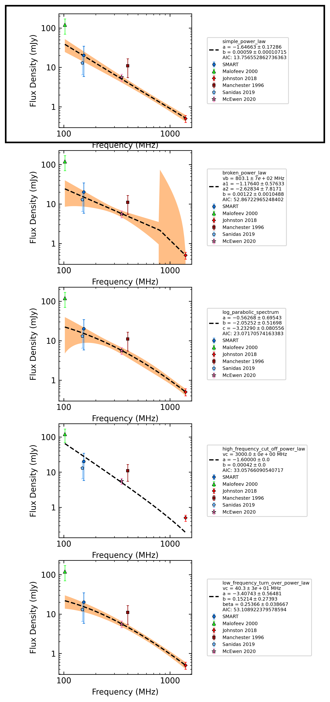
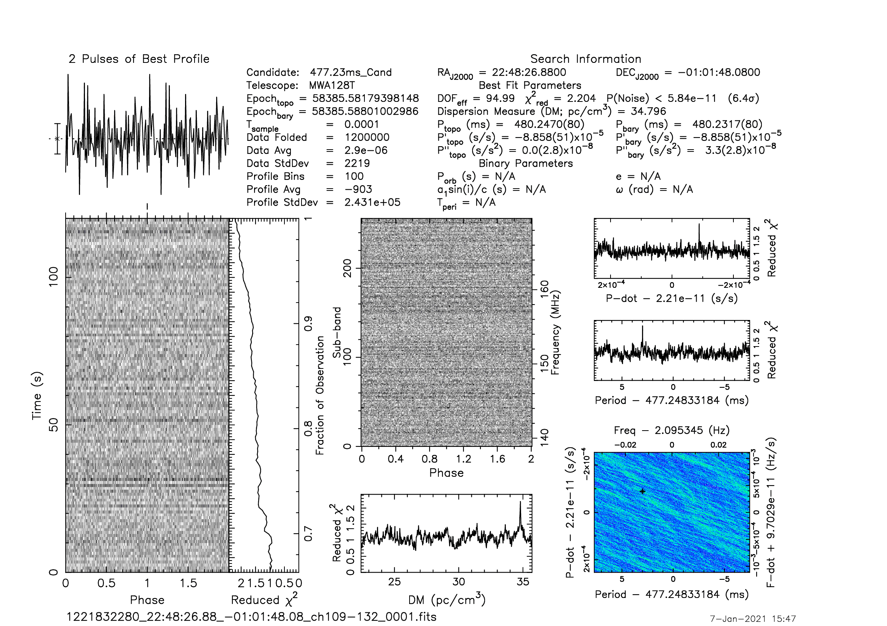
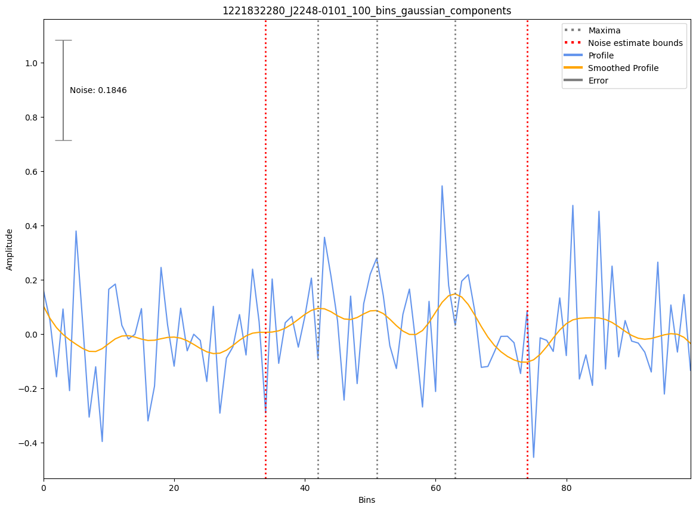

.. _J2248-0101:
J2248-0101
==========

Best Fit
--------

.. csv-table:: J2248-0101 fit results
   :header: "model","a","b"

   "simple_power_law","-1.65±0.17","0.00±0.00"

Fit Before MWA
--------------

.. csv-table:: J2248-0101 before fit results
   :header: "model","a","b"

   "simple_power_law","-1.64±0.19","0.00±0.00"

Flux Density Results
--------------------
.. csv-table:: J2248-0101 flux density total results
   :header: "N obs", "Flux Density (mJy)", "u_S_mean", "u_scint", "m_r_v"

   "1",  "20.2±14.4", "9.8", "10.5", "0.520"

.. csv-table:: J2248-0101 flux density individual results
   :header: "ObsID", "Flux Density (mJy)"

    "1221832280", "20.2±9.8"

Comparison Fit
--------------

Detection Plots
---------------

