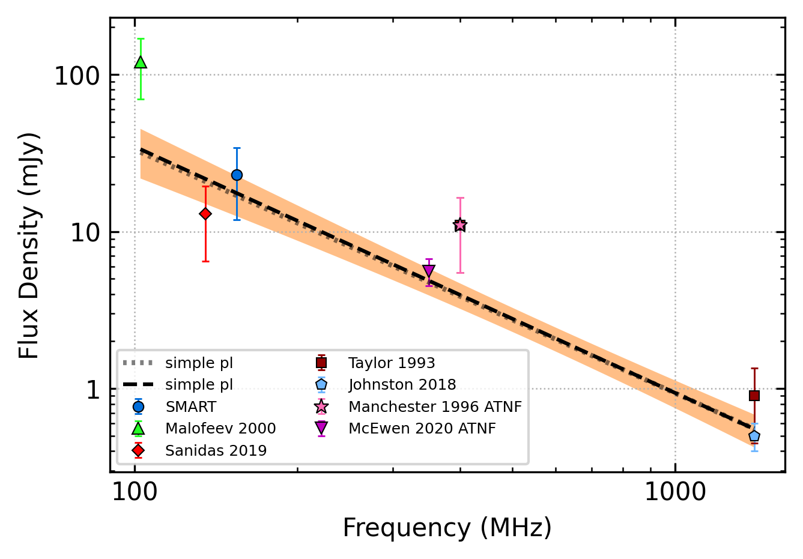
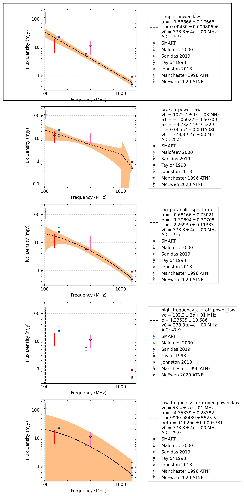

.. _J2248-0101:
J2248-0101
==========

Best Fit
--------

.. csv-table:: J2248-0101 fit results
   :header: "model","a","b","v0 (MHz)"

   "simple_power_law","-1.56±0.18","0.00±0.00","378±3"

Fit Before MWA
--------------

.. csv-table:: J2248-0101 before fit results
   :header: "model","a","b","v0 (MHz)"

   "simple_power_law","-1.55±0.19","0.00±0.00","378±3"

Flux Density Results
--------------------
.. csv-table:: J2248-0101 flux density total results
   :header: "N obs", "Flux Density (mJy)", "u_S_mean", "u_scint", "m_r_v"

   "1",  "23.1±16.4", "11.2", "12.0", "0.520"

.. csv-table:: J2248-0101 flux density individual results
   :header: "ObsID", "Flux Density (mJy)"

    "1221832280", "23.1±11.2"

Comparison Fit
--------------

Detection Plots
---------------

.. image:: on_pulse_plots/1221832280_J2248-0101_100_bins_gaussian_components.png
  :width: 800