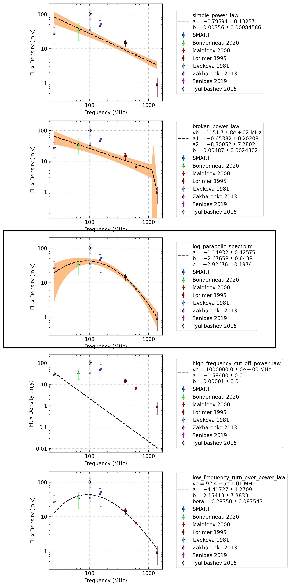
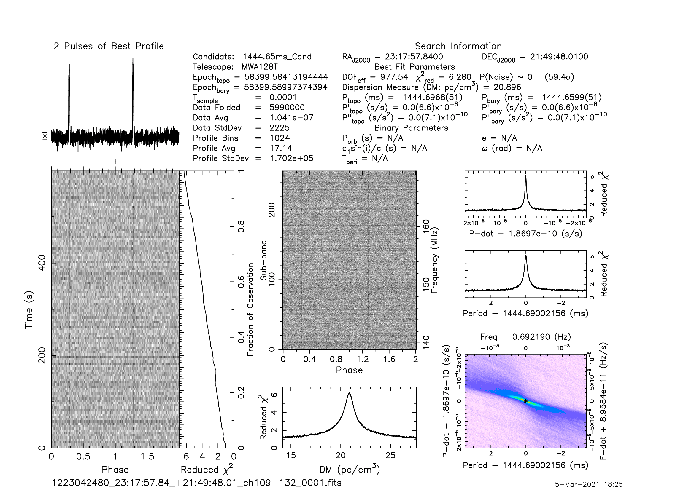
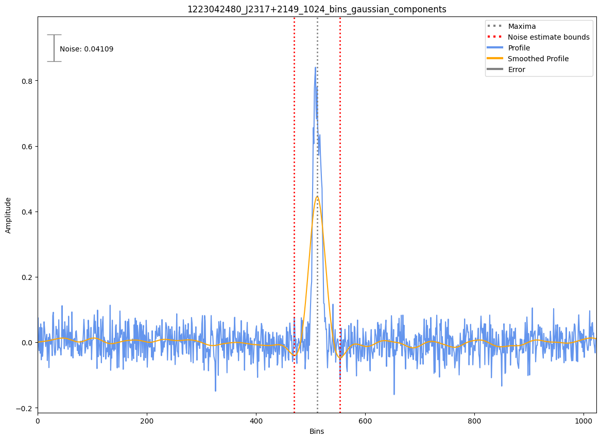

.. _J2317+2149:
J2317+2149
==========

Best Fit
--------
.. image:: best_fits/J2317+2149_o_fit.png
  :width: 800

.. csv-table:: J2317+2149 fit results
   :header: "model","a","b","c","v0 (MHz)"

   "o","-1.15±0.43","-0.74±0.16","-1.49±0.08","187±1"

Fit Before MWA
--------------

.. csv-table:: J2317+2149 before fit results
   :header: "model","a","b","c","v0 (MHz)"

   "o","-1.14±0.42","-0.74±0.16","-1.49±0.08","187±1"

Flux Density Results
--------------------
.. csv-table:: J2317+2149 flux density total results
   :header: "N obs", "Flux Density (mJy)", "u_S_mean", "u_scint", "m_r_v"

   "1",  "51.7±32.1", "6.7", "31.4", "0.607"

.. csv-table:: J2317+2149 flux density individual results
   :header: "ObsID", "Flux Density (mJy)"

    "1223042480", "51.7±6.7"

Comparison Fit
--------------

Detection Plots
---------------

