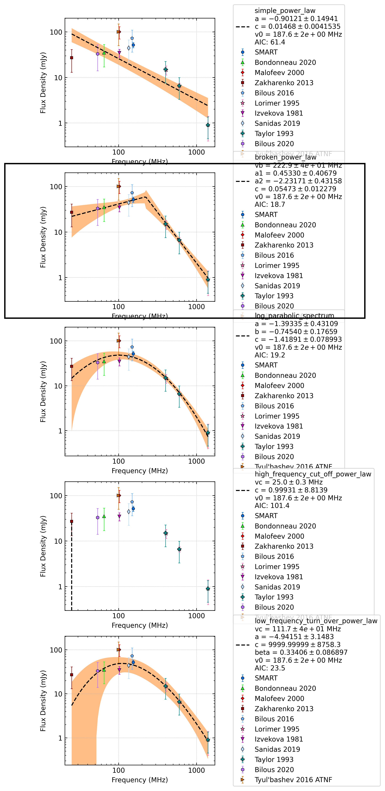

.. _J2317+2149:
J2317+2149
==========

Best Fit
--------
.. image:: best_fits/J2317+2149_log_parabolic_spectrum_fit.png
  :width: 800

.. csv-table:: J2317+2149 fit results
   :header: "model","a","b","c"

   "log_parabolic_spectrum","-1.13±0.29","-2.68±0.47","-2.93±0.15"

Fit Before MWA
--------------
.. image:: before_mwa/J2317+2149_log_parabolic_spectrum_fit.png
  :width: 800

.. csv-table:: J2317+2149 before fit results
   :header: "model","a","b","c"

   "log_parabolic_spectrum","-1.12±0.30","-2.66±0.47","-2.93±0.15"

Flux Density Results
--------------------
.. csv-table:: J2317+2149 flux density total results
   :header: "N obs", "Flux Density (mJy)", "u_S_mean", "u_scint", "m_r_v"

   "1",  "45.2±28.1", "5.9", "27.5", "0.607"

.. csv-table:: J2317+2149 flux density individual results
   :header: "ObsID", "Flux Density (mJy)"

    "1223042480", "45.2±5.9"

Comparison Fit
--------------

Detection Plots
---------------

.. image:: on_pulse_plots/1223042480_J2317+2149_1024_bins_gaussian_components.png
  :width: 800