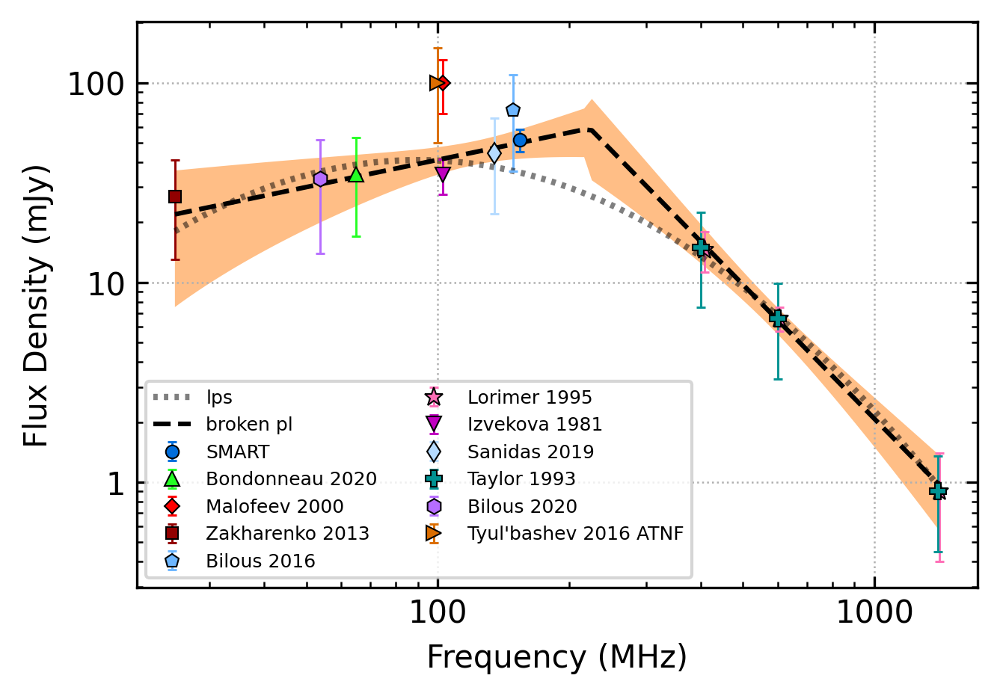

.. _J2317+2149:
J2317+2149
==========

Best Fit
--------

.. csv-table:: J2317+2149 fit results
   :header: "model","vpeak (MHz)","a","c","beta","v0 (MHz)"

   "low_frequency_turn_over_power_law","84±14","-8.00±5.85","72281076797726343036928.00±362128679709935365259264.00","0.13±0.01","187±1"

Fit Before MWA
--------------

.. csv-table:: J2317+2149 before fit results
   :header: "model","vpeak (MHz)","a","c","beta","v0 (MHz)"

   "low_frequency_turn_over_power_law","83±14","-8.00±5.61","140367977508965781078016.00±711682596419538094391296.00","0.13±0.01","187±1"

Flux Density Results
--------------------
.. csv-table:: J2317+2149 flux density total results
   :header: "N obs", "Flux Density (mJy)", "u_S_mean", "u_scint", "m_r_v"

   "1",  "51.7±32.1", "6.7", "31.4", "0.607"

.. csv-table:: J2317+2149 flux density individual results
   :header: "ObsID", "Flux Density (mJy)"

    "1223042480", "51.7±6.7"

Comparison Fit
--------------
.. image:: comparison_fits/J2317+2149_comparison_fit.png
  :width: 800

Detection Plots
---------------

.. image:: detection_plots/pf_1223042480_J2317+2149_23:17:57.84_+21:49:48.01_b1024_1444.65ms_Cand.pfd.png
  :width: 800

.. image:: on_pulse_plots/1223042480_J2317+2149_1024_bins_gaussian_components.png
  :width: 800