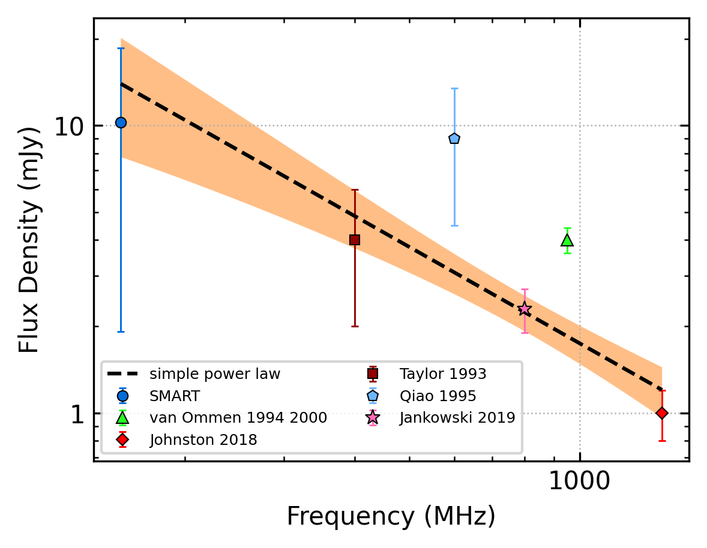
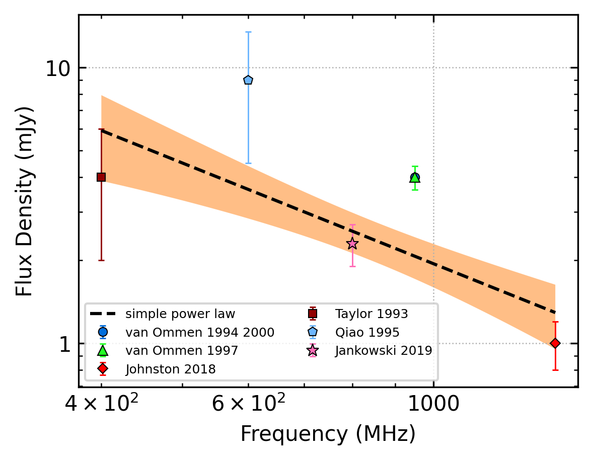
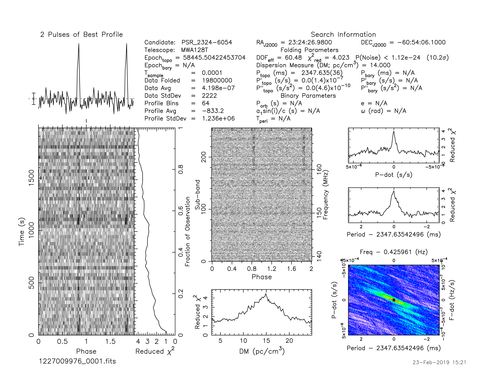

.. _J2324-6054:
J2324-6054
==========

Best Fit
--------

.. csv-table:: J2324-6054 fit results
   :header: "model","a","b"

   "simple_power_law","-1.17±0.29","0.00±0.00"

Fit Before MWA
--------------

.. csv-table:: J2324-6054 before fit results
   :header: "model","a","b"

   "simple_power_law","-1.27±0.37","0.00±0.00"

Flux Density Results
--------------------
.. csv-table:: J2324-6054 flux density total results
   :header: "N obs", "Flux Density (mJy)", "u_S_mean", "u_scint", "m_r_v"

   "1",  "11.6±9.4", "4.1", "8.5", "0.733"

.. csv-table:: J2324-6054 flux density individual results
   :header: "ObsID", "Flux Density (mJy)"

    "1227009976", "11.6±4.1"

Comparison Fit
--------------
.. image:: comparison_fits/J2324-6054_comparison_fit.png
  :width: 800

Detection Plots
---------------

.. image:: on_pulse_plots/1227009976_J2324-6054_64_bins_gaussian_components.png
  :width: 800