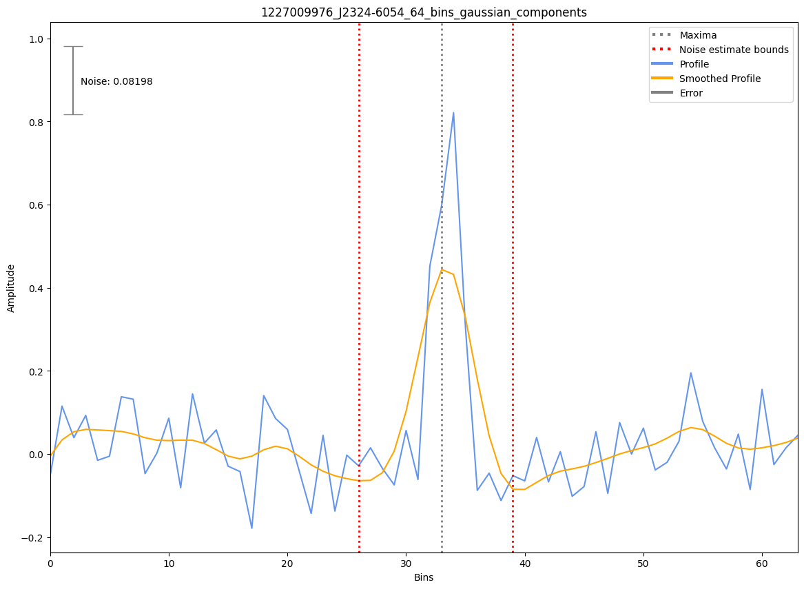

.. _J2324-6054:
J2324-6054
==========

Best Fit
--------
.. image:: best_fits/J2324-6054_log_parabolic_spectrum_fit.png
  :width: 800

.. csv-table:: J2324-6054 fit results
   :header: "model","a","b","c"

   "log_parabolic_spectrum","-5.00±4.47","-3.34±0.42","-2.82±0.08"

Fit Before MWA
--------------
.. image:: before_mwa/J2324-6054_simple_power_law_fit.png
  :width: 800

.. csv-table:: J2324-6054 before fit results
   :header: "model","a","b"

   "simple_power_law","-1.21±0.40","0.00±0.00"

Flux Density Results
--------------------
.. csv-table:: J2324-6054 flux density total results
   :header: "N obs", "Flux Density (mJy)", "u_S_mean", "u_scint", "m_r_v"

   "1",  "10.3±8.4", "3.6", "7.5", "0.733"

.. csv-table:: J2324-6054 flux density individual results
   :header: "ObsID", "Flux Density (mJy)"

    "1227009976", "10.3±3.6"

Comparison Fit
--------------
.. image:: comparison_fits/J2324-6054_comparison_fit.png
  :width: 800

Detection Plots
---------------

