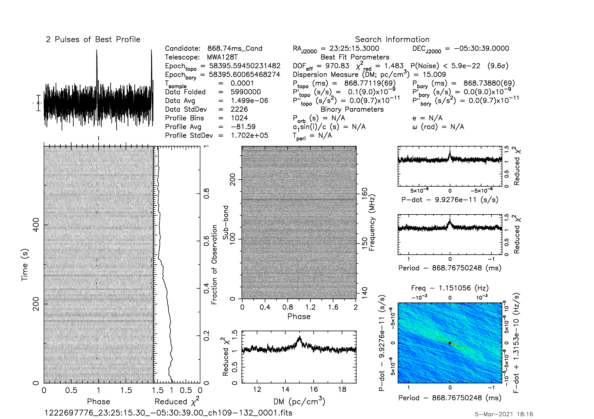
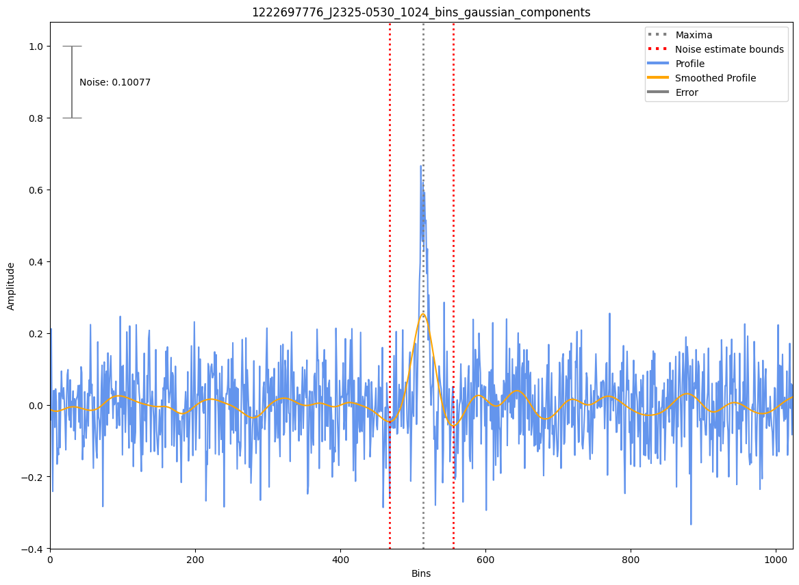

.. _J2325-0530:
J2325-0530
==========

Best Fit
--------
Only 1 MWA data and 1 cat data available

Flux Density Results
--------------------
.. csv-table:: J2325-0530 flux density total results
   :header: "N obs", "Flux Density (mJy)", "u_S_mean", "u_scint", "m_r_v"

   "1",  "13.2±10.1", "3.9", "9.4", "0.710"

.. csv-table:: J2325-0530 flux density individual results
   :header: "ObsID", "Flux Density (mJy)"

    "1222697776", "13.2±3.9"

Detection Plots
---------------

