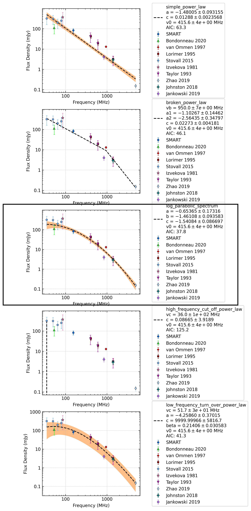

.. _J2330-2005:
J2330-2005
==========

Best Fit
--------

.. csv-table:: J2330-2005 fit results
   :header: "model","vpeak (MHz)","a","c","beta","v0 (MHz)"

   "log_parabolic_spectrum","-0.65±0.17","-1.46±0.09","-1.54±0.09","415±4"

Fit Before MWA
--------------

.. csv-table:: J2330-2005 before fit results
   :header: "model","vpeak (MHz)","a","c","beta","v0 (MHz)"

   "log_parabolic_spectrum","-0.68±0.19","-1.49±0.13","-1.51±0.09","415±4"

Flux Density Results
--------------------
.. csv-table:: J2330-2005 flux density total results
   :header: "N obs", "Flux Density (mJy)", "u_S_mean", "u_scint", "m_r_v"

   "2",  "82.4±51.9", "18.3", "76.6", "0.929"

.. csv-table:: J2330-2005 flux density individual results
   :header: "ObsID", "Flux Density (mJy)"

    "1222697776", "77.6±12.1"
    "1226062160", "87.2±13.7"

Comparison Fit
--------------

Detection Plots
---------------

