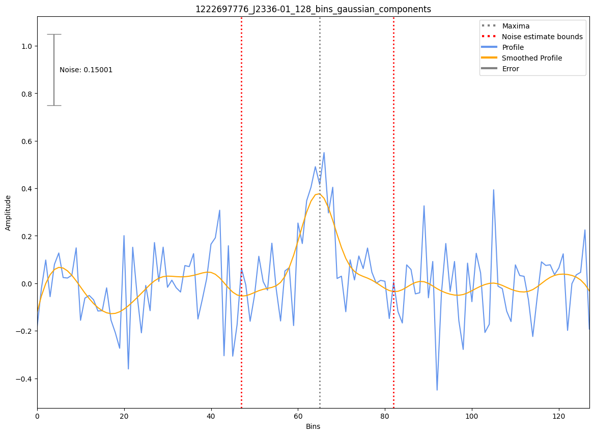

.. _J2336-01:
J2336-01
========

Best Fit
--------
Only 1 MWA data and 0 cat data available

Flux Density Results
--------------------
.. csv-table:: J2336-01 flux density total results
   :header: "N obs", "Flux Density (mJy)", "u_S_mean", "u_scint", "m_r_v"

   "1",  "52.6±34.5", "10.1", "32.9", "0.626"

.. csv-table:: J2336-01 flux density individual results
   :header: "ObsID", "Flux Density (mJy)"

    "1222697776", "52.6±10.1"

Detection Plots
---------------

.. image:: detection_plots/pf_1222697776_J2336-01_23:36:36.00_-01:51:00.00_b128_1029.80ms_Cand.pfd.png
  :width: 800

