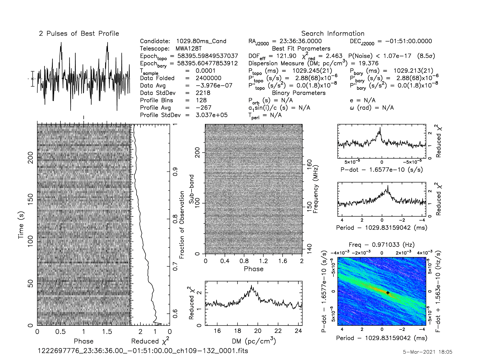

J2336-01
========

Flux Density Results
--------------------
.. csv-table:: J2336-01 flux density total results
   :header: "N obs", "Flux Density (mJy)", " u_S_mean", "u_scint", "m_r_v"

   "1",  "45.9±30.0", "8.8", "28.7", "0.626"

.. csv-table:: J2336-01 flux density individual results
   :header: "ObsID", "Flux Density (mJy)"

    "1222697776", "45.9±8.8"

Comparison Fit
--------------
.. image:: comparison_fits/J2336-01_comparison_fit.png
  :width: 800

Detection Plots
---------------

