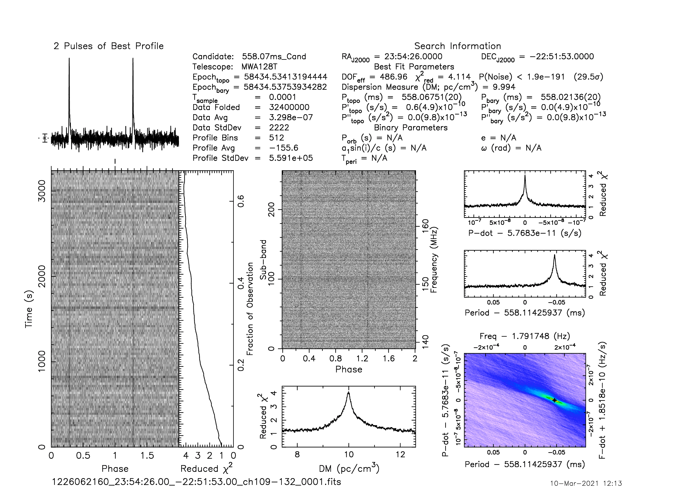
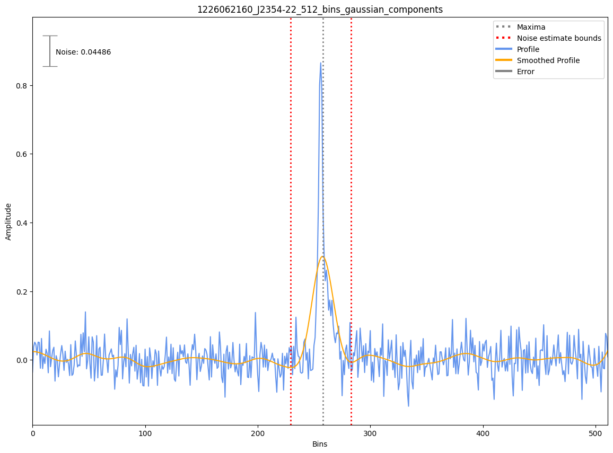

J2354-22
========

Flux Density Results
--------------------
.. csv-table:: J2354-22 flux density total results
   :header: "N obs", "Flux Density (mJy)", " u_S_mean", "u_scint", "m_r_v"

   "1",  "13.7±12.1", "2.6", "11.9", "0.862"

.. csv-table:: J2354-22 flux density individual results
   :header: "ObsID", "Flux Density (mJy)"

    "1226062160", "13.7±2.6"

Comparison Fit
--------------
.. image:: comparison_fits/J2354-22_comparison_fit.png
  :width: 800

Detection Plots
---------------

